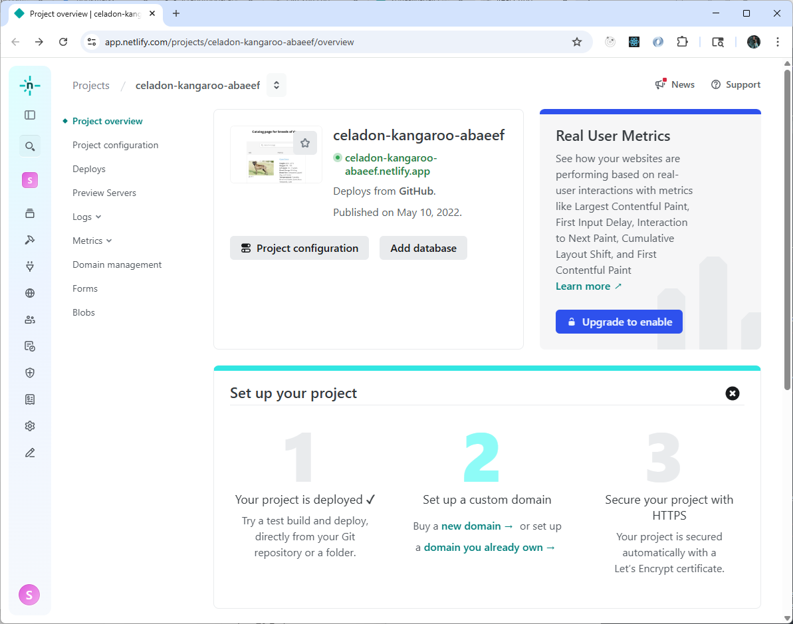
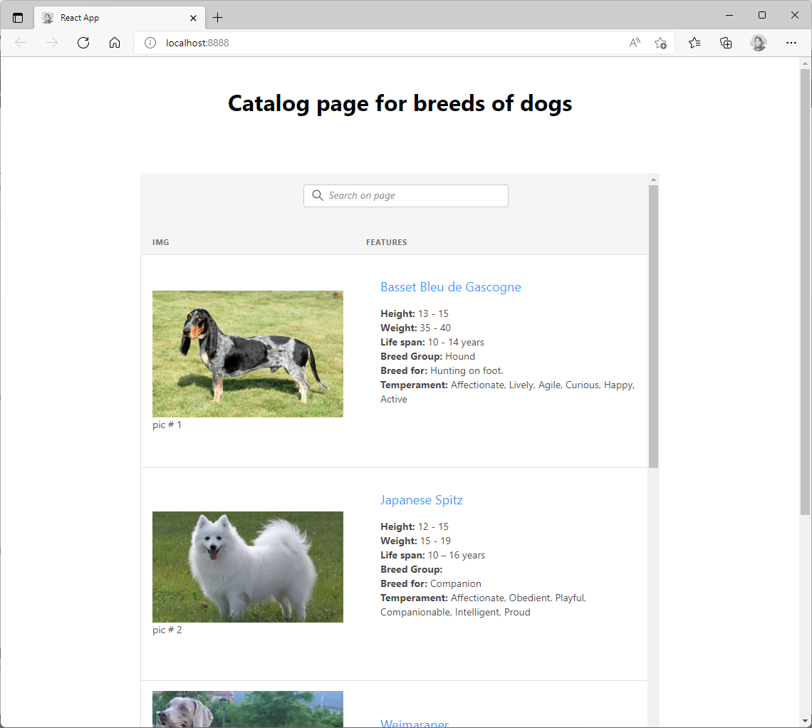
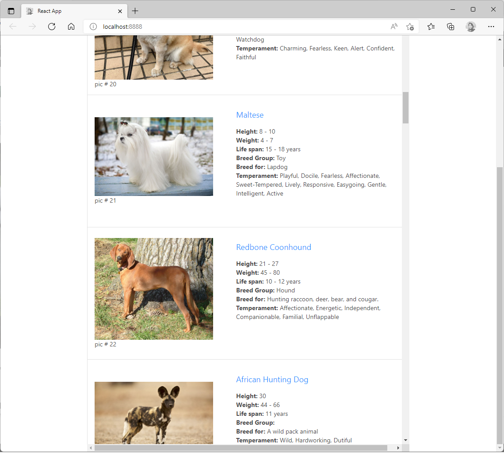
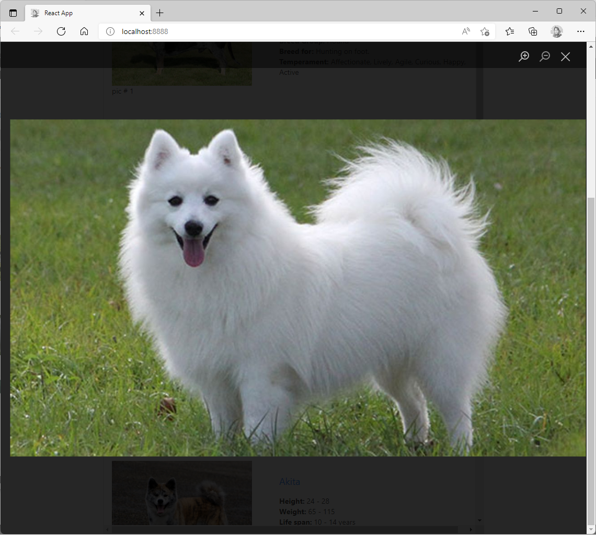
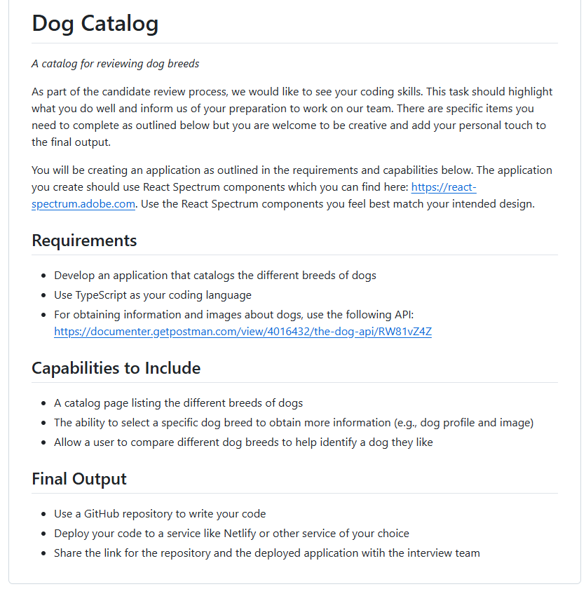

# 🐶 Dog Breed Catalog (Adobe React Spectrum Prototype)

A React + TypeScript application that catalogs and displays information on various dog breeds using data from The [Dog API](https://thedogapi.com/).

This project was built to demonstrate the use of Adobe’s React Spectrum UI library within a scalable, high-performance React app, solving key compatibility and interoperability challenges across React 16, 17, and 18.

This project not only showcases frontend development skills, but also demonstrates architectural problem-solving and performance optimization critical for enterprise-grade applications.


# 🌐 Live Demo & Project Link

- [DEMO - Live since May 2022](https://celadon-kangaroo-abaeef.netlify.app/)

- [GitHub - React v18 Spectrum Dog Breeds Search](https://github.com/luoqiuyun/react-18-spectrum-dog-breeds-search)


# 🐱 GitHub Repository

- 

- 

- 

- 

- 


# ✨ Key Achievements
- ✅ Solved compatibility issues with React 16, 17, and 18 for @adobe/react-spectrum

- ✅ Resolved interoperability conflicts with third-party libraries

- ✅ Implemented lazy loading and optimized data rendering for high performance

- ✅ Delivered a fully working, production-grade solution, deployed to Netlify (May 2022)


# 💻  Technologies Used

- React 16/17/18 (cross-version support)

- TypeScript

- @adobe/react-spectrum

- Axios

- Netlify for deployment

- Serverless 


# 🏗️ Architectural Highlights

- Lazy Loading: Only the visible dog breed cards load images and data, improving performance and responsiveness.

- Cross-Version Compatibility: Fixed critical issues to ensure React Spectrum works seamlessly across React 16, 17, and 18.

- Third-Party Interoperability: Resolved styling, state management, and compatibility issues to ensure smooth interoperability between React Spectrum and other libraries.

- Spectrum Integration: Overcame initial incompatibility of React Spectrum with multiple React versions and ensured UI consistency.

- Accessibility Focus: Implemented ARIA best practices and keyboard-friendly interactions.


# 🚀 Quick Start 
To run the project locally:

```bash
git clone https://github.com/luoqiuyun/react-18-spectrum-dog-breeds-search.git
cd react-18-spectrum-dog-breeds-search
npm install
npm start
```


## 🔗 Screenshots

1. Adobe Spectrum Catalog Deployed to Netlify Successfully



2. Adobe Spectrum Catalog Landing Page with Search Box



3. Adobe Spectrum Catalog Scroll Down Continue Loading



4. Adobe Spectrum Catalog Photo Modal



5. Adobe Spectrum Catalog Project Requirements




# Getting Started with Create React App

This project was bootstrapped with [Create React App](https://github.com/facebook/create-react-app).

## Available Scripts

In the project directory, you can run:

### `ntl dev`
### `yarn start`

Runs the app in the development mode.\
Open [http://localhost:3000](http://localhost:3000) to view it in the browser.

The page will reload if you make edits.\
You will also see any lint errors in the console.

### `yarn test`

Launches the test runner in the interactive watch mode.\
See the section about [running tests](https://facebook.github.io/create-react-app/docs/running-tests) for more information.

### `yarn build`

Builds the app for production to the `build` folder.\
It correctly bundles React in production mode and optimizes the build for the best performance.

The build is minified and the filenames include the hashes.\
Your app is ready to be deployed!

See the section about [deployment](https://facebook.github.io/create-react-app/docs/deployment) for more information.

### `yarn eject`

**Note: this is a one-way operation. Once you `eject`, you can’t go back!**

If you aren’t satisfied with the build tool and configuration choices, you can `eject` at any time. This command will remove the single build dependency from your project.

Instead, it will copy all the configuration files and the transitive dependencies (webpack, Babel, ESLint, etc) right into your project so you have full control over them. All of the commands except `eject` will still work, but they will point to the copied scripts so you can tweak them. At this point you’re on your own.

You don’t have to ever use `eject`. The curated feature set is suitable for small and middle deployments, and you shouldn’t feel obligated to use this feature. However we understand that this tool wouldn’t be useful if you couldn’t customize it when you are ready for it.

## Learn More

You can learn more in the [Create React App documentation](https://facebook.github.io/create-react-app/docs/getting-started).

To learn React, check out the [React documentation](https://reactjs.org/).
